# NTNU Mobile Applications (IDATA2503) - Investmate (StockApp)
### Group 4
## Introduction

Welcome to Investmate, a Flutter project developed by students at NTNU for the course IDATA2503 - Mobile Applications. Investmate provides a user-friendly interface for buying and selling simulated stocks, allowing you to experience the financial world right at your fingertips and make informed investment decisions with ease. Dive into the world of stock trading with Investmate!

## User Stories

1. **View Stocks:** As a user, I want to view a list of simulated stocks so I can see my options.

2. **Detailed Stock View:** As a user, I want to click on a stock and view its detailed information, including its price and percentage change.

3. **Buy Stocks:** As a user, I want to buy stocks by specifying the number of shares I want so that they can be added to my portfolio.

4. **Sell Stocks:** As a user, I want to sell stocks from my portfolio so I can cash in on my investments.

5. **Portfolio View:** As a user, I want to view my current stock portfolio, including the total value and individual stock performances, so I can track my investments.

6. **Search Functionality:** As a user, I want to search for specific stocks so I can find them quickly.

7. **User Authentication:** As a user, I want to register, log in, and secure my account, including password encryption, so that my portfolio and transaction history remain private.

8. **Personal Stock Lists:** As a user, I want to add and remove stocks to different personal lists.

9. **Alerts and Notifications:** (Future feature)

### Use-case diagram


## User Guide
* To view the application's user guide visit: [User guide](https://github.com/IDATA2503-Mobile-Applikasjoner/aksje_app/wiki/User-Guide)

## Sprint reports
* The development team worked with agile software development, working in sprints with meetings each week.
* To view our development process you can visit our wiki: [Sprint reports](https://github.com/IDATA2503-Mobile-Applikasjoner/aksje_app/wiki/Sprints)


## Specifications


### General:

- **Platform:** Mobile (iOS & Android)
- **Language:** English (with potential for localization in future updates)
- **Theme:** Light & Dark mode support

### Features:

1. **Stock Listings:**
   - Simulated stocks
   - Display stock name, current price, and daily change percentage
   - Scrollable list with pull-to-refresh functionality

2. **Stock Details:**
   - Price and percentage change
   - Candlestick chart
   - Buy/Sell options

4. **User Portfolio:**
   - Display user's total portfolio value in a line chart
   - List of owned stocks with current value and percentage change

5. **Search & Filters:**
   - Search bar to quickly find stocks
   - Filtering options based on highest/lowest price and biggest earners/losers.

6. **Notifications:**
   - Live action notification on ios (currently unavailable due to payment/high cost)

7. **User Authentication:**
   - Secure login and registration process
   - Password encryption

8. **Data & API Integration:**
   - Integration with self-made backend using spring boot

### Performance & Scalability:

- **Database:** Utilize efficient database systems (PostgreSQL databases) for storing user data, transaction history, and other app-related data.
- **Scalability:** Design the backend infrastructure to handle a growing number of users and increased data traffic.

### Security:

- **Data Encryption:** Ensure that sensitive user data, including passwords and financial transactions, are encrypted.

### Accessibility:

- Ensure the app is usable for people with disabilities:
  - Screen reader compatibility
  - Font size adjustment
  - High-contrast themes


## Folder Structure
```plaintext
Investmate/
│
├── lib/
│   ├── images/
│   │   └── Investmate.png
│   │   └── InvestmentBro.png
│   │
│   ├── models/
│   │   └── portfolio_history.dart
│   │   └── portfolio.dart
│   │   └── stock_history.dart
│   │   └── stock_list_model.dart
│   │   └── stock_purchase.dart
│   │   └── stock.dart
│   │   └── user.dart
│   │
│   ├── providers/
│   │   └── token_manager.dart
│   │   └── user_provider.dart
│   │
│   ├── widgets/
│   │   ├── components/
│   │   │   └── flush_bar.dart
│   │   │   └── login_button.dart
│   │   │   └── navigation_bar.dart
│   │   │   └── pop_up_menu_profile.dart
│   │   │
│   │   ├── screens/
│   │   │   └── add_list.dart
│   │   │   └── explore.dart
│   │   │   └── inventory.dart
│   │   │   └── log_in.dart
│   │   │   └── main_page.dart
│   │   │   └── my_lists.dart
│   │   │   └── new_user.dart
│   │   │   └── sign_up.dart
│   │   │   └── splash.dart
│   │   │   └── stock_detail.dart
│   │   │   └── stock_watchlist_page.dart
│   │   │
│   │   ├── stock_components/
│   │   │   └── portfolio_chart.dart
│   │   │   └── stock_card.dart
│   │   │   └── stock_chart.dart
│   │   │   └── stock_item.dart
│   │   │   └── stock_list.dart
│   │   │
│   │   └── stock_list_components/
│   │       └── stock_list_item.dart
│   │
│   ├── globals.dart
│   ├── main.dart
│
├── pubspec.yaml
└── README.md
```
### Class Diagram Back-End


### Class Diagram Front-End

```mermaid
classDiagram
class MyApp
MyApp : +createState() State<MyApp>
StatefulWidget <|-- MyApp

class _MyAppState
_MyAppState : -_pages$ List~Widget~
_MyAppState : +build() Widget
State <|-- _MyAppState

class Portfolio
Portfolio : +pid int
Portfolio : +user User
Portfolio o-- User
Portfolio : +stockPurchases Set~StockPurchase~

class PortfolioHistory
PortfolioHistory : +phid int
PortfolioHistory : +date DateTime
PortfolioHistory : +price double

class Stock
Stock : +id int
Stock : +symbol String
Stock : +name String
Stock : +currentPrice double
Stock : +openingPrice double
Stock : +percentChangeIntraday double
Stock : +toJson() Map<String, dynamic>

class StockHistory
StockHistory : +date DateTime
StockHistory : +open double
StockHistory : +close double
StockHistory : +high double
StockHistory : +low double
StockHistory : +volume int

class StockListModel
StockListModel : +lid int
StockListModel : +name String
StockListModel : +stocks List~Map~String, dynamic~~
StockListModel : +valid bool

class StockPurchase
StockPurchase : +spid int
StockPurchase : +date DateTime
StockPurchase : +price double
StockPurchase : +quantity int

class User
User : +email String
User : +password String
User : +uid int
User : +toJson() Map<String, dynamic>

class TokenManager
TokenManager : +storage$ FlutterSecureStorage
TokenManager o-- FlutterSecureStorage
TokenManager : +storeToken()$ void
TokenManager : +getToken()$ dynamic
TokenManager : +removeToken()$ void

class UserProvider
UserProvider : -_user User?
UserProvider o-- User
UserProvider : +user User?
UserProvider o-- User
UserProvider : +setUser() void
ChangeNotifier <|-- UserProvider

class CustomNavigationBar
CustomNavigationBar : +selectedIndex int
CustomNavigationBar : +onItemTapped dynamic Functionint
CustomNavigationBar o-- dynamic Functionint
CustomNavigationBar : +build() Widget
StatelessWidget <|-- CustomNavigationBar

class AddListPage
AddListPage : +createState() _AddListPageState
StatefulWidget <|-- AddListPage

class _AddListPageState
_AddListPageState : +nameController TextEditingController
_AddListPageState o-- TextEditingController
_AddListPageState : -_addListToServer() dynamic
_AddListPageState : -_createList() void
_AddListPageState : -_checkIfNameIsValid() bool
_AddListPageState : -_navMyListPage() void
_AddListPageState : +build() Widget
State <|-- _AddListPageState

class ExplorePage
ExplorePage : +createState() _ExplorePageState
StatefulWidget <|-- ExplorePage

class _ExplorePageState
_ExplorePageState : +stocks List~Stock~
_ExplorePageState : +filteredStocks List~Stock~
_ExplorePageState : +isLoading bool
_ExplorePageState : +initState() void
_ExplorePageState : -_fetchStocksDataFromServer() dynamic
_ExplorePageState : -_goToStockDetailPage() dynamic
_ExplorePageState : -_navToStockDetailPage() void
_ExplorePageState : -_filterStocks() void
_ExplorePageState : -_sortStocksByHighestPrice() void
_ExplorePageState : -_sortStocksByLowestPrice() void
_ExplorePageState : -_sortStocksByBiggestEarner() void
_ExplorePageState : -_sortStocksByBiggestLoser() void
_ExplorePageState : -_showSortOptions() void
_ExplorePageState : -_onRefresh() dynamic
_ExplorePageState : +build() Widget
State <|-- _ExplorePageState

class Inventory
Inventory : +createState() State<Inventory>
StatefulWidget <|-- Inventory

class _InventoryState
_InventoryState : +stocks List~Stock~
_InventoryState : +monetaryChange double?
_InventoryState : +percentageChange double?
_InventoryState : +portfolioHistory List~PortfolioHistory~
_InventoryState : +initState() void
_InventoryState : +didChangeDependencies() void
_InventoryState : -_goToStockDetailPage() void
_InventoryState : -_fetchStockDataFromServer() dynamic
_InventoryState : -_setPortfolioHistoriesWithDataFromServer() dynamic
_InventoryState : -_futureYourDevelopmentDataFromServer() dynamic
_InventoryState : -_setDevelopmentText() dynamic
_InventoryState : -_onRefresh() dynamic
_InventoryState : +build() Widget
State <|-- _InventoryState

class LoginPage
LoginPage : +createState() _LoginPageState
StatefulWidget <|-- LoginPage

class _LoginPageState
_LoginPageState : +emailController TextEditingController
_LoginPageState o-- TextEditingController
_LoginPageState : +passwordController TextEditingController
_LoginPageState o-- TextEditingController
_LoginPageState : +storage FlutterSecureStorage
_LoginPageState o-- FlutterSecureStorage
_LoginPageState : +isLoggedIn bool
_LoginPageState : +isLoading bool
_LoginPageState : +login() dynamic
_LoginPageState : +getLoginUser() dynamic
_LoginPageState : +storeToken() void
_LoginPageState : +getToken() dynamic
_LoginPageState : +removeToken() void
_LoginPageState : +navSignUpPage() void
_LoginPageState : +build() Widget
State <|-- _LoginPageState

class MainPage
MainPage : +selectedIndex int
MainPage : +createState() State<MainPage>
StatefulWidget <|-- MainPage

class _MainPageState
_MainPageState : -_pages$ List~Widget~
_MainPageState : -_onItemTapped() void
_MainPageState : +build() Widget
State <|-- _MainPageState

class MyListsPage
MyListsPage : +createState() _MyListsPageState
StatefulWidget <|-- MyListsPage

class _MyListsPageState
_MyListsPageState : +lists List~StockListModel~
_MyListsPageState : +isLoading bool
_MyListsPageState : +initState() void
_MyListsPageState : +didChangeDependencies() void
_MyListsPageState : -_fetchDataFromServer() dynamic
_MyListsPageState : -_navToAddListPage() void
_MyListsPageState : -_goTiListPageWithDataFromServer() dynamic
_MyListsPageState : -_navToListPage() void
_MyListsPageState : +build() Widget
State <|-- _MyListsPageState

class NewUserPage
NewUserPage : +build() Widget
StatelessWidget <|-- NewUserPage

class OnboardingPagePresenter
OnboardingPagePresenter : +pages List~NewUSerPageModel~
OnboardingPagePresenter : +onSkip void Function?
OnboardingPagePresenter o-- void Function
OnboardingPagePresenter : +onFinish void Function?
OnboardingPagePresenter o-- void Function
OnboardingPagePresenter : +createState() State<OnboardingPagePresenter>
StatefulWidget <|-- OnboardingPagePresenter

class _OnboardingPageState
_OnboardingPageState : -_currentPage int
_OnboardingPageState : -_pageController PageController
_OnboardingPageState o-- PageController
_OnboardingPageState : -_navigateToLoginPage() void
_OnboardingPageState : +build() Widget
State <|-- _OnboardingPageState

class NewUSerPageModel
NewUSerPageModel : +title String
NewUSerPageModel : +description String
NewUSerPageModel : +imageUrl String
NewUSerPageModel : +bgColor Color
NewUSerPageModel o-- Color
NewUSerPageModel : +textColor Color
NewUSerPageModel o-- Color

class SignUp
SignUp : +createState() _SignUpState
StatefulWidget <|-- SignUp

class _SignUpState
_SignUpState : +emailController TextEditingController
_SignUpState o-- TextEditingController
_SignUpState : +passwordController TextEditingController
_SignUpState o-- TextEditingController
_SignUpState : +confirmPasswordController TextEditingController
_SignUpState o-- TextEditingController
_SignUpState : +checkPassword() bool
_SignUpState : +createUser() dynamic
_SignUpState : +navToLoginSuccessScreen() void
_SignUpState : +cancel() void
_SignUpState : +build() Widget
State <|-- _SignUpState

class Splash
Splash : +createState() _SplashState
StatefulWidget <|-- Splash

class _SplashState
_SplashState : -_controller AnimationController
_SplashState o-- AnimationController
_SplashState : -_animation Animation~double~
_SplashState o-- Animation~double~
_SplashState : +initState() void
_SplashState : +dispose() void
_SplashState : +build() Widget
State <|-- _SplashState
SingleTickerProviderStateMixin <|-- _SplashState

class StockDetailPage
StockDetailPage : +stock Stock
StockDetailPage o-- Stock
StockDetailPage : +createState() _StockDetailPageState
StatefulWidget <|-- StockDetailPage

class _StockDetailPageState
_StockDetailPageState : +stockLists List~StockListModel~
_StockDetailPageState : +stock Stock
_StockDetailPageState o-- Stock
_StockDetailPageState : +timer Timer
_StockDetailPageState o-- Timer
_StockDetailPageState : +stockHistories List~StockHistory~
_StockDetailPageState : +initState() void
_StockDetailPageState : +dispose() void
_StockDetailPageState : -_fetcListDataFromServer() dynamic
_StockDetailPageState : -_showListOptions() void
_StockDetailPageState : -_addStockToListInServer() dynamic
_StockDetailPageState : -_addStockPrchaseToServer() dynamic
_StockDetailPageState : -_buyStock() void
_StockDetailPageState : -_getStockDataFromServer() dynamic
_StockDetailPageState : -_getPrucheasStockStocksFromServer() dynamic
_StockDetailPageState : -_checkIfUserOwnStock() dynamic
_StockDetailPageState : -_getPrucheasStockFromServer() dynamic
_StockDetailPageState : -_setStockHistoriesWithDataFromServer() dynamic
_StockDetailPageState : -_removeStockPurchase() dynamic
_StockDetailPageState : -_showAddToListDialog() void
_StockDetailPageState : -_onRefresh() dynamic
_StockDetailPageState : +build() Widget
State <|-- _StockDetailPageState

class StockWatchlistPage
StockWatchlistPage : +stockList StockListModel
StockWatchlistPage o-- StockListModel
StockWatchlistPage : +createState() _StockWatchlistPageState
StatefulWidget <|-- StockWatchlistPage

class _StockWatchlistPageState
_StockWatchlistPageState : +stocks List~Stock~
_StockWatchlistPageState : +isLoading bool
_StockWatchlistPageState : +newNameController TextEditingController
_StockWatchlistPageState o-- TextEditingController
_StockWatchlistPageState : +initState() void
_StockWatchlistPageState : -_fetchStocksDataFromServer() dynamic
_StockWatchlistPageState : -_setStocksData() void
_StockWatchlistPageState : -_getStockDataFromnServer() dynamic
_StockWatchlistPageState : -_removeStockFromList() dynamic
_StockWatchlistPageState : -_updateListName() dynamic
_StockWatchlistPageState : -_removeList() dynamic
_StockWatchlistPageState : -_goToStockDetailPage() void
_StockWatchlistPageState : -_navToStockDetailPage() void
_StockWatchlistPageState : -_onRefresh() dynamic
_StockWatchlistPageState : -_showNewNameOption() void
_StockWatchlistPageState : -_navMyListPage() void
_StockWatchlistPageState : +build() Widget
State <|-- _StockWatchlistPageState

class StockCard
StockCard : +stock Stock
StockCard o-- Stock
StockCard : +onTap void Function
StockCard o-- void Function
StockCard : +build() Widget
StatelessWidget <|-- StockCard

class StockItem
StockItem : +stock Stock
StockItem o-- Stock
StockItem : +build() Widget
StatelessWidget <|-- StockItem

class StockList
StockList : +stocks List~Stock~
StockList : +onStockTap dynamic FunctionStock
StockList o-- dynamic FunctionStock
StockList : +onRemoveStock dynamic FunctionStock?
StockList o-- dynamic FunctionStock
StockList : +isDeleteEnabled bool
StockList : +build() Widget
StatelessWidget <|-- StockList

class StockListItem
StockListItem : +stockList StockListModel
StockListItem o-- StockListModel
StockListItem : +onStockListTap dynamic FunctionStockListModel
StockListItem o-- dynamic FunctionStockListModel
StockListItem : +build() Widget
StatelessWidget <|-- StockListItem

class StockListModelList
StockListModelList : +stockLists List~StockListModel~
StockListModelList : +onStockListTap dynamic FunctionStockListModel
StockListModelList o-- dynamic FunctionStockListModel
StockListModelList : +build() Widget
StatelessWidget <|-- StockListModelList
```


### Domain Diagram Database


## Conclusion

Investmate represents the culmination of our learning and efforts in the IDATA2503 - Mobile Applications course at NTNU. This project, centered around a stock trading simulation app, has provided us with invaluable experience in mobile app development, from conceptualization to implementation. While Investmate serves as a simulated platform for stock trading, its primary purpose has been educational, allowing us as students to apply our skills in a practical setting. We appreciate the opportunity to develop this project and are thankful for the insights gained during the process.

---

For more documentation regarding Investmate, please visit our wiki page [Investmate wiki](https://github.com/IDATA2503-Mobile-Applikasjoner/aksje_app/wiki).


  
